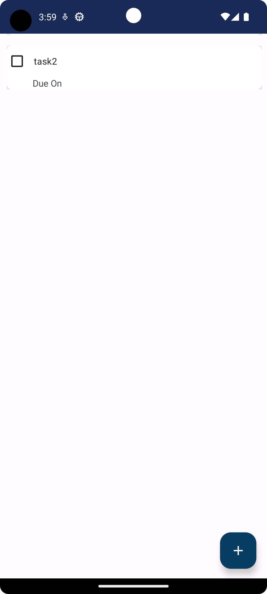

This is a Mobile Application Development Project of Harsh Sharma (211B131), Harsh Awasthi (211B129) and Harshit Sharma (211B133).

To-Do-App is basically a android application to remind task with date to finished.

Getting Started
1.Clone the repository to your local machine.
2.Open the project in Android Studio.
3.In the Project Structure dialog, make sure that the SDK Location is set to the location of your Android SDK.
4.Click the Run button to build and deploy your app to your device.